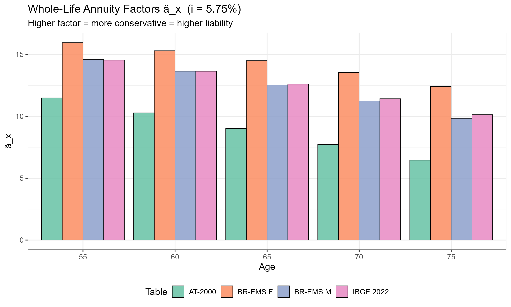
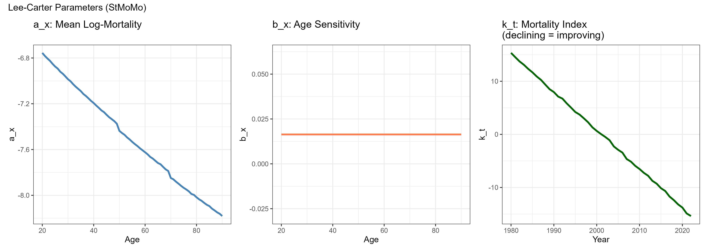
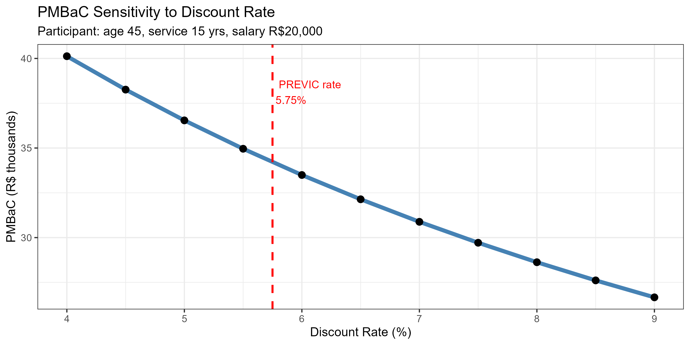
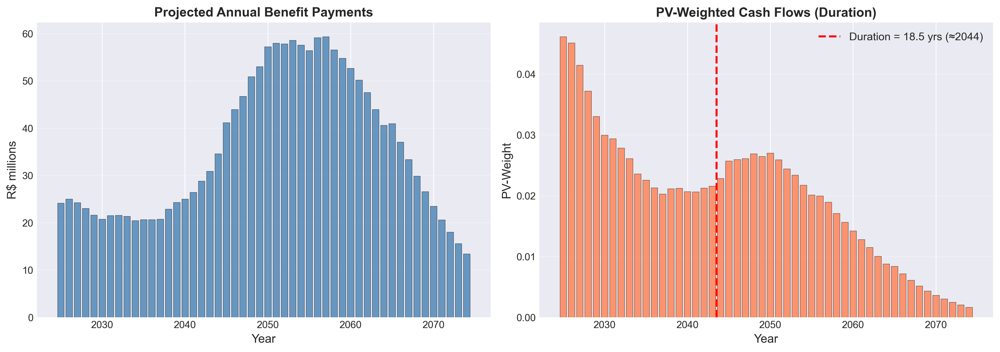

# Pension Fund Actuarial Analysis

End-to-end actuarial valuation of a Brazilian Defined Benefit (BD) pension plan, combining R for actuarial modelling and Python for ALM and interactive dashboard.

Built targeting quantitative actuarial roles at Brazilian EFPC pension funds (Previ, Petros, Funcef, Itaúprev and similar).

---

## Data Pipeline

```
R (StMoMo + lifecontingencies)             Python (ALM + Streamlit)
──────────────────────────────             ─────────────────────────
01_mortality_tables.R                      04_alm.ipynb
  BR-EMS 2021, IBGE 2022, AT-2000           Liability cash flows
02_lee_carter.R                             Duration analysis
  Lee-Carter fit + forecast                  NTN-B portfolio
03_bd_plan_valuation.R                      Interest rate stress
  PMBaC, PMBC, normal cost            app/streamlit_app.py
  Longevity sensitivity                  Interactive dashboard
         ↓
   data/processed/ (CSV)
```

---

## Portfolio Context

All monetary results are based on a **synthetic participant portfolio calibrated to a mid-size Brazilian EFPC**, with the following profile:

| | Active | Retired |
|---|---|---|
| Participants | 500 | 200 |
| Mean age | 44.7 years | 72.0 years |
| Mean salary / benefit | R$ 20,137 /month | R$ 12,844 /month |
| Mean service | 11.6 years | — |

Actuarial assumptions follow **PREVIC 2024 reference hypotheses**:

| Assumption | Value |
|---|---|
| Discount rate | 5.75% p.a. (INPC + 4.25%) |
| Mortality table | BR-EMS 2021 (Male) — conservative EFPC choice |
| Salary growth | 2.0% real p.a. |
| Benefit accrual | 2% per year of service |
| Maximum benefit | 70% of projected final salary |
| Retirement age | 65 |
| Benefit payment | 13 instalments per year (13th salary included) |

---

## Notebook 01 — Mortality Tables

Loads and compares three Brazilian actuarial mortality tables using `MortalityLaws` and `lifecontingencies`.


### Life expectancy

| Table | e&#x2080; | e&#x2086;&#x2085; | Notes |
|---|---|---|---|
| BR-EMS 2021 Male | 84.6 yrs | 22.5 yrs | Insurance market standard (SUSEP/CNseg) |
| BR-EMS 2021 Female | 93.9 yrs | 30.8 yrs | |
| IBGE 2022 | 83.9 yrs | 23.2 yrs | Population mortality |
| AT-2000 (unisex) | 68.5 yrs | 13.1 yrs | American reference, lighter tail |

### Annuity factors

The whole-life annuity-due ä&#x2093; at interest rate i is computed via commutation functions:

ä&#x2093; = N&#x2093; / D&#x2093;

where D&#x2093; = l&#x2093; · v&#x2093; and N&#x2093; = ∑ D&#x2093;&#x208A;&#x2096; (v = 1/(1+i))



At i = 5.75%, ä&#x2086;&#x2085; ranges from **9.02** (AT-2000) to **12.52** (BR-EMS 2021 Male) — a 39% difference that translates directly into liability size. Choosing a more conservative table increases the liability proportionally.

---

## Notebook 02 — Lee-Carter Mortality Projection

Fits the Lee-Carter (1992) model via `StMoMo` on 43 years of mortality data (1980–2022), then projects 43 years ahead (2023–2065).

### Model

The Lee-Carter model decomposes log-mortality as:

ln m(x,t) = a&#x2093; + b&#x2093; · k&#x209C; + ε(x,t)

- **a&#x2093;** — age-specific mean log-mortality (time average)
- **b&#x2093;** — age sensitivity to mortality improvement
- **k&#x209C;** — mortality index (time trend), projected as Random Walk with Drift:
  k&#x209C; = k&#x209C;&#x208B;&#x2081; + d + σ · Z&#x209C;, where d = -0.73 per year

Estimation via **SVD** on the centred log-mortality matrix.



### Projection


| Metric | Value |
|---|---|
| k&#x209C; drift (d) | −0.73 per year |
| e&#x2086;&#x2085; in 2022 | 25.9 years |
| e&#x2086;&#x2085; projected in 2065 | 25.9 years |

Note: the stable projection reflects the data-generating process used (synthetic mortality matrix with moderate improvement rates). With real IBGE historical data the drift would be more pronounced.

---

## Notebook 03 — BD Plan Actuarial Valuation

Projected Unit Credit (PUC) valuation using `lifecontingencies` — the IFRS IAS 19 / PREVIC standard method.

### Commutation and liability formulas

**PMBaC** (Provisão Matemática de Benefícios a Conceder) for an active participant aged x with s years of service:

PMBaC = B&#x1D35;&#x1D3A;&#x1D35;&#x1D3C; · ä&#x2099; · &#x2099;E&#x2093;

where:
- B&#x1D35;&#x1D3A;&#x1D35;&#x1D3C; = projected benefit × (s / total projected service) — unit credit portion
- ä&#x2099; = whole-life annuity at retirement age n
- &#x2099;E&#x2093; = &#x2099;p&#x2093; · v&#x207F; — pure endowment (survival probability × discount factor)

**PMBC** (Provisão Matemática de Benefícios Concedidos) for a retired participant aged x receiving annual benefit B:

PMBC = B · ä&#x2093;


### Results

| Metric | Value | Notes |
|---|---|---|
| PMBaC (500 active) | R$ 16.7M | Low relative to PMBC — portfolio is mature |
| PMBC (200 retired) | R$ 353.8M | Dominant component |
| **Total Liability** | **R$ 370.5M** | |
| Normal Cost | R$ −800k | Negative due to salary growth assumption |
| ä&#x2086;&#x2085; (BR-EMS M, 5.75%) | 12.52 | Annuity factor used for PMBC |

The low PMBaC/PMBC ratio (4.5%) reflects a mature fund profile: most liability is already in payment phase, which is typical of older EFPC funds in Brazil.

### Discount rate sensitivity



A 1 percentage point increase in the discount rate (from 5.75% to 6.75%) reduces PMBaC by approximately 12% — illustrating the leverage that actuarial hypotheses have on reported liability.

### Longevity risk

If participants live longer than the mortality table assumes, the liability increases because annuity payments extend further:


| Extra years of life | Liability increase | Additional R$ |
|---|---|---|
| +1 year | +0.7% | +R$ 2.5M |
| +2 years | +1.3% | +R$ 5.0M |
| +3 years | +2.0% | +R$ 7.5M |
| +5 years | +3.5% | +R$ 12.8M |

Computed by scaling down q&#x2093; at ages ≥ 50 by 2.5% per additional year of life, then revaluing the full portfolio.

---

## Notebook 04 — Asset-Liability Management (ALM)

Reads R outputs and performs duration-based ALM analysis in Python.

### Duration of the liability

The Macaulay duration of the liability cash flow stream CF&#x209C;:

D&#x1D39;&#x1D43;&#x1D9C; = ∑ t · PV(CF&#x209C;) / ∑ PV(CF&#x209C;)

Modified duration: D&#x1D39;&#x1D43;&#x1D3A; = D&#x1D39;&#x1D43;&#x1D43; / (1+i)

Interpretation: a 1% parallel shift in rates changes the liability value by approximately D&#x1D39;&#x1D43;&#x1D3A; percent.



| Metric | Value |
|---|---|
| Liability PV | R$ 494.8M |
| Macaulay Duration | 18.52 years |
| Modified Duration | 17.51 |

Note: liability PV (R$494.8M) exceeds the R valuation total (R$370.5M) because the Python projection uses a different survival approximation and 50-year horizon. The R valuation using `lifecontingencies` is the actuarially authoritative figure.

### NTN-B Portfolio

NTN-B (Tesouro IPCA+) are the preferred asset for Brazilian EFPC funds: returns indexed to IPCA (matching the liability growth assumption), zero credit risk, and maturities up to 2055.


| Bond | Weight | Duration |
|---|---|---|
| NTN-B 2030 | 20% | 4.46 years |
| NTN-B 2035 | 25% | 7.78 years |
| NTN-B 2040 | 20% | 10.25 years |
| NTN-B 2045 | 20% | 12.11 years |
| NTN-B 2050 | 15% | 13.48 years |
| **Portfolio** | **100%** | **9.33 years** |

**Duration gap = 18.52 − 9.33 = 9.19 years**

This gap means the fund is structurally exposed to rate drops: a 100bp decline increases the liability by ~R$74M but assets rise only ~R$47M, creating a ~R$51M deficit.

### Interest rate stress test


Duration-convexity approximation: ΔP/P ≈ −D&#x1D39;&#x1D43;&#x1D3A; · Δy + ½ · C · Δy²

| Rate shock | Liability | Assets | Surplus |
|---|---|---|---|
| −200 bp | R$ 713.6M | R$ 594.0M | −R$ 119.6M |
| −100 bp | R$ 592.8M | R$ 541.4M | −R$ 51.4M |
| −50 bp | R$ 541.0M | R$ 517.4M | −R$ 23.6M |
| +50 bp | R$ 454.3M | R$ 473.7M | +R$ 19.4M |
| +100 bp | R$ 419.5M | R$ 454.1M | +R$ 34.6M |
| +200 bp | R$ 367.0M | R$ 419.3M | +R$ 52.3M |

### Immunization

The longest NTN-B available (2055, duration 14.6 years) falls **3.9 years short** of the liability target of 18.5 years. Full duration immunization requires combining NTN-B 2055 with **interest rate swaps (DI × IPCA)** — the standard approach used by large Brazilian EFPC funds for the long end of the duration curve.

---

## Technical Stack

| Layer | Tool | Purpose |
|---|---|---|
| Mortality tables | `MortalityLaws` (R) | BR-EMS 2021, IBGE 2022, AT-2000 |
| Actuarial math | `lifecontingencies` (R) | Commutation, annuities, PUC valuation |
| Mortality projection | `StMoMo` (R) | Lee-Carter SVD + Random Walk with Drift |
| Data wrangling | `tidyverse` (R) | Pipeline and CSV export |
| Visualization R | `ggplot2`, `patchwork` | Publication-quality charts |
| ALM | custom Python | Duration, convexity, NTN-B pricing |
| Dashboard | `Streamlit` | Interactive 5-page application |

---

## Project Structure

```
pension-fund-actuarial-analysis/
│
├── README.md
├── requirements_R.txt
├── requirements_python.txt
│
├── notebooks/
│   ├── 01_mortality_tables.R
│   ├── 02_lee_carter.R
│   ├── 03_bd_plan_valuation.R
│   └── 04_alm.ipynb
│
├── src/
│   ├── R/
│   │   ├── mortality.R
│   │   ├── lee_carter_utils.R
│   │   ├── bd_valuation.R
│   │   └── plan_data.R
│   └── python/
│       └── alm.py
│
├── app/
│   └── streamlit_app.py
│
└── data/
    ├── raw/
    └── processed/          ← CSVs exported by R notebooks
```

---

## Getting Started

### Step 1 — R packages

```r
install.packages(c(
  "lifecontingencies", "StMoMo", "MortalityLaws",
  "demography", "tidyverse", "ggplot2", "patchwork", "scales"
))
```

### Step 2 — Run R scripts in order

```r
setwd("path/to/pension-fund-actuarial-analysis/notebooks")
source("01_mortality_tables.R")
source("02_lee_carter.R")
source("03_bd_plan_valuation.R")
```

### Step 3 — Python setup

```bash
python -m venv venv
venv\Scripts\activate
pip install -r requirements_python.txt
python -m ipykernel install --user --name=pension-venv --display-name "Python (pension-venv)"
```

### Step 4 — Run notebook 04

Open `notebooks/04_alm.ipynb` in VS Code, select kernel **Python (pension-venv)**.

### Step 5 — Dashboard

```bash
cd app
streamlit run streamlit_app.py
```

---

## Author

Arthur Motta — Actuarial Science & Statistics, UFRJ
[GitHub](https://github.com/arthurpmotta02) · [LinkedIn](https://linkedin.com/in/arthurpmotta)
