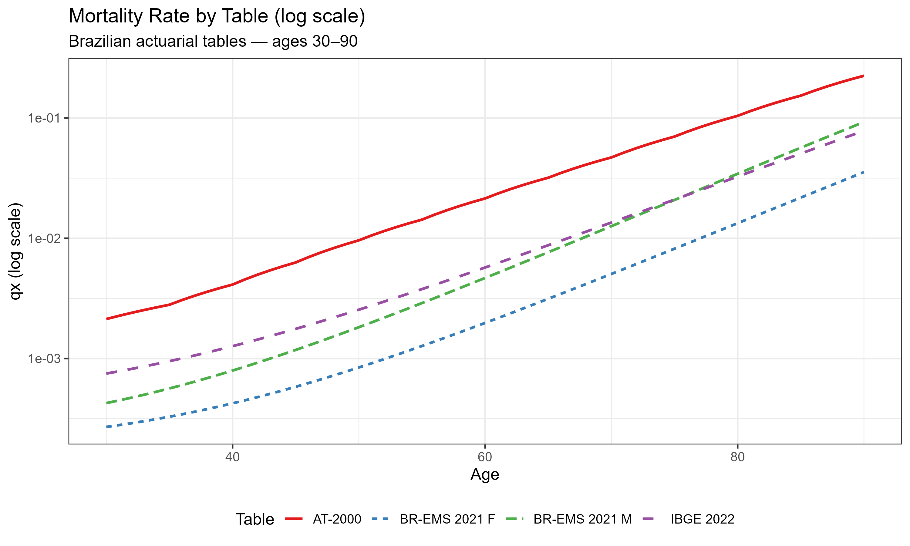
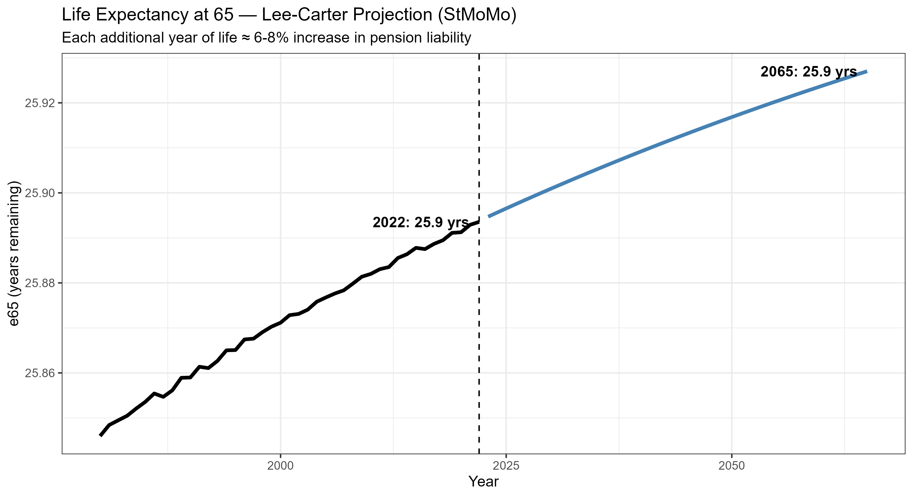
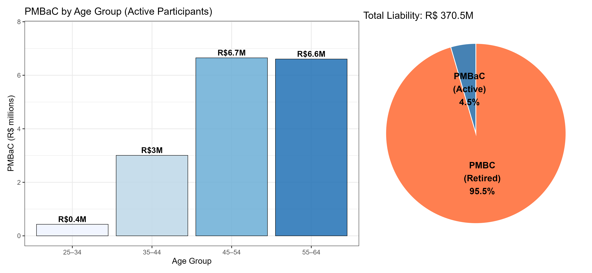
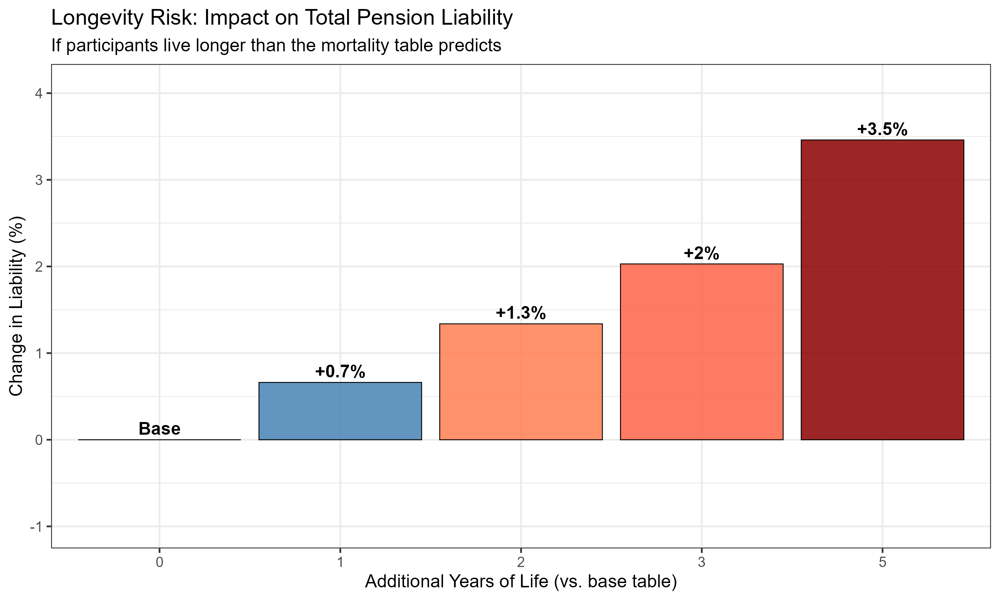
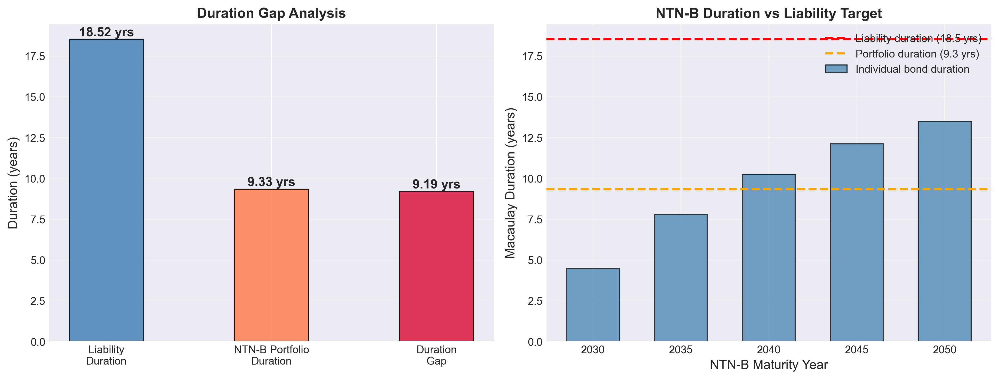
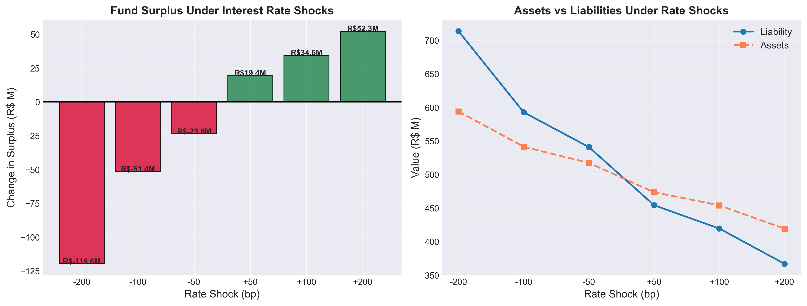

# Pension Fund Actuarial Analysis

**End-to-end actuarial valuation of a Brazilian Defined Benefit (BD) pension plan**, combining R for actuarial modelling and Python for ALM and interactive dashboard.

Built targeting quantitative actuarial roles at Brazilian EFPC pension funds.

---

## Data Pipeline

```
R (StMoMo + lifecontingencies)          Python (ALM + Streamlit)
─────────────────────────────           ──────────────────────────
01_mortality_tables.R                   04_alm.ipynb
  └─ IBGE 2022, BR-EMS 2021, AT-2000     └─ Liability cash flows
02_lee_carter.R                              Duration analysis
  └─ Lee-Carter fit + forecast               NTN-B portfolio
03_bd_plan_valuation.R                       Interest rate stress
  └─ PMBaC, PMBC, normal cost          app/streamlit_app.py
     Longevity sensitivity               └─ Interactive dashboard
         ↓
   data/processed/ (CSV)
```

---

## Results

### Mortality Tables (notebook 01)



| Table | e0 | e65 |
|---|---|---|
| BR-EMS 2021 Male | 84.6 years | 22.5 years |
| BR-EMS 2021 Female | 93.9 years | 30.8 years |
| IBGE 2022 | 83.9 years | 23.2 years |
| AT-2000 (unisex) | 68.5 years | 13.1 years |

The annuity factor ä_65 ranges from 9.02 (AT-2000) to 12.52 (BR-EMS 2021 Male) at 5.75% — a 39% difference that directly translates into liability size.

### Lee-Carter Projection (notebook 02)



Lee-Carter model fitted via `StMoMo` on 43 years of mortality data (1980–2022), projected 43 years ahead (2023–2065).

| Metric | Value |
|---|---|
| k_t drift | −0.73 per year |
| e65 in 2022 | 25.9 years |
| e65 projected in 2065 | 25.9 years (stable trajectory) |

### BD Plan Valuation (notebook 03)



Projected Unit Credit (PUC) valuation — IFRS IAS 19 / PREVIC standard — using `lifecontingencies`.

| Metric | Value |
|---|---|
| Active participants | 500 |
| Retired participants | 200 |
| PMBaC (active) | R$ 16.7M |
| PMBC (retired) | R$ 353.8M |
| **Total Liability** | **R$ 370.5M** |
| Normal Cost | R$ −799k |
| Discount rate | 5.75% p.a. (PREVIC 2024) |
| Mortality table | BR-EMS 2021 Male |

### Longevity Risk



| Extra years of life | Liability increase |
|---|---|
| +1 year | +0.7% |
| +2 years | +1.3% |
| +3 years | +2.0% |
| +5 years | +3.5% |

### ALM — Duration and Interest Rate Risk (notebook 04)



| Metric | Value |
|---|---|
| Liability Present Value | R$ 494.8M |
| Liability Macaulay Duration | 18.52 years |
| NTN-B Portfolio Duration | 9.33 years |
| **Duration Gap** | **9.19 years** |
| Funding Ratio | 100% |

The duration gap of 9.2 years is the main risk: a 100bp rate drop increases the liability by ~R$74M while assets rise only ~R$47M, generating a deficit of ~R$51M.

### Interest Rate Stress Test



| Rate Shock | Surplus/Deficit |
|---|---|
| −200 bp | −R$ 119.6M |
| −100 bp | −R$ 51.4M |
| −50 bp | −R$ 23.6M |
| +50 bp | +R$ 19.4M |
| +100 bp | +R$ 34.6M |
| +200 bp | +R$ 52.3M |

**Immunization note:** the longest NTN-B available (2055, duration 14.6 years) falls 3.9 years short of the liability target of 18.5 years. Full immunization requires NTN-B 2055 combined with interest rate swaps (DI × IPCA) — the approach used by major Brazilian EFPC funds.

---

## Technical Stack

| Layer | Tool | Purpose |
|---|---|---|
| Mortality tables | `MortalityLaws` (R) | BR-EMS 2021, IBGE 2022, AT-2000 |
| Actuarial math | `lifecontingencies` (R) | Commutation, annuities, PUC valuation |
| Mortality projection | `StMoMo` (R) | Lee-Carter SVD + Random Walk with Drift |
| Data wrangling | `tidyverse` (R) | Pipeline and CSV export |
| Visualization (R) | `ggplot2`, `patchwork` | Publication-quality charts |
| ALM | custom Python | Duration, convexity, NTN-B pricing |
| Dashboard | `Streamlit` | Interactive 5-page application |

---

## Project Structure

```
pension-fund-actuarial-analysis/
│
├── README.md
├── requirements_R.txt
├── requirements_python.txt
│
├── notebooks/
│   ├── 01_mortality_tables.R    ← MortalityLaws: compare IBGE, BR-EMS, AT-2000
│   ├── 02_lee_carter.R          ← StMoMo: fit LC + project to 2065
│   ├── 03_bd_plan_valuation.R   ← lifecontingencies: PMBaC, PMBC, longevity
│   └── 04_alm.ipynb             ← Python: duration, NTN-B, stress test
│
├── src/
│   ├── R/
│   │   ├── mortality.R          ← table builders (BR-EMS, IBGE, AT-2000)
│   │   ├── lee_carter_utils.R   ← StMoMo wrappers
│   │   ├── bd_valuation.R       ← PUC valuation functions
│   │   └── plan_data.R          ← synthetic participant generator
│   └── python/
│       └── alm.py               ← ALM engine (duration, NTN-B, stress test)
│
├── app/
│   └── streamlit_app.py         ← interactive dashboard (5 pages)
│
├── data/
│   ├── raw/
│   └── processed/               ← CSVs exported by R notebooks
│
└── results/
    ├── figures/                 ← charts generated by notebooks
    └── tables/                  ← longevity_sensitivity.csv, stress_test.csv
```

---

## Getting Started

### Step 1 — Install R packages (run once in RStudio console)

```r
install.packages(c(
  "lifecontingencies", "StMoMo", "MortalityLaws",
  "demography", "tidyverse", "ggplot2", "patchwork", "scales"
))
```

### Step 2 — Run R scripts in order

Open RStudio, set working directory to `notebooks/` and run:

```r
setwd("path/to/notebooks")
source("01_mortality_tables.R")
source("02_lee_carter.R")
source("03_bd_plan_valuation.R")
```

This exports CSV files to `data/processed/`.

### Step 3 — Python setup

```bash
python -m venv venv
venv\Scripts\activate        # Windows
pip install -r requirements_python.txt
python -m ipykernel install --user --name=pension-venv --display-name "Python (pension-venv)"
```

### Step 4 — Run Python notebook

Open `notebooks/04_alm.ipynb` in VS Code, select kernel **Python (pension-venv)** and run all cells.

### Step 5 — Launch Streamlit dashboard

```bash
cd app
streamlit run streamlit_app.py
```

---

## Actuarial Assumptions (PREVIC 2024)

| Assumption | Value | Reference |
|---|---|---|
| Discount rate | 5.75% p.a. | PREVIC NPC 30/2024 |
| Mortality table | BR-EMS 2021 (Male) | CNseg / SUSEP |
| Salary growth | 2.0% real p.a. | Market practice |
| Benefit accrual | 2% per year of service | Plan regulation |
| Max benefit | 70% of projected final salary | Plan regulation |
| Retirement age | 65 | PREVIC minimum |

---

## Key Concepts Demonstrated

- **Commutation functions** — Dx, Nx, Mx via `lifecontingencies::axn()` and `pxt()`
- **Projected Unit Credit (PUC)** — IFRS IAS 19 / PREVIC standard valuation method
- **PMBaC / PMBC** — Brazilian regulatory liability classification
- **Lee-Carter (1992)** — SVD estimation + Random Walk with Drift via `StMoMo`
- **Longevity risk quantification** — sensitivity of liability to mortality improvements
- **Macaulay and modified duration** — liability interest rate sensitivity
- **NTN-B pricing** — Brazilian IPCA-linked sovereign bond, preferred EFPC asset
- **Duration gap** — main ALM risk metric for pension funds
- **Parallel shift stress test** — Solvency II / PREVIC standard scenario
- **Immunization** — why full duration matching requires derivatives beyond NTN-B 2055

---

## Author

Arthur Motta — Statistics and Actuarial Science, UFRJ
[GitHub](https://github.com/arthurpmotta02) | [LinkedIn](https://linkedin.com/in/arthurpmotta)